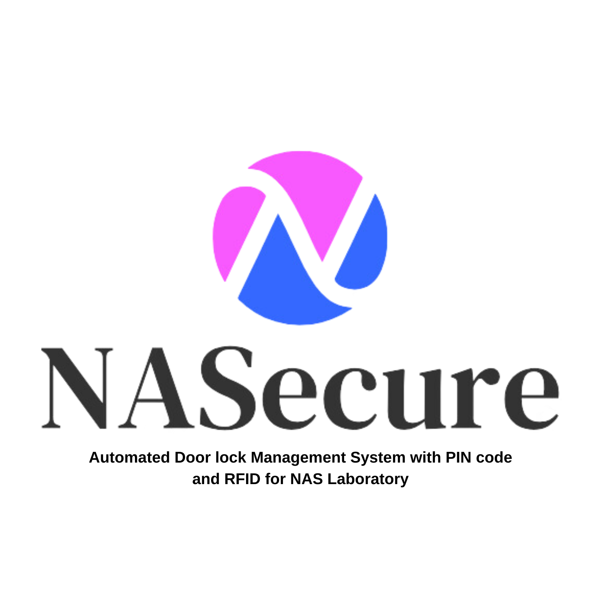

# Laravel 11 Application Installation Guide




## Prerequisites

Ensure you have the following installed:
- PHP (recommended version: PHP 8.1 or higher)
- Composer
- Node.js and npm
- XAMPP (for local development)

## Installation Steps

1. **Clone the Repository**

   If you haven't already, clone the repository to your local machine:
   ```bash
   git clone https://github.com/nameoftheuser1/nasecure
   cd nasecure
   ```

2. **Install Composer Dependencies**

   Run the following command to install PHP dependencies using Composer:
   ```bash
   composer install
   ```

3. **Install NPM Dependencies**

   Install Node.js dependencies with npm:
   ```bash
   npm install
   ```

4. **Set Up the Environment File**

   Copy the `.env.example` file to `.env` and update the environment settings as needed:
   ```bash
   cp .env.example .env
   ```

5. **Generate the Application Key**

   Generate a new application key:
   ```bash
   php artisan key:generate
   ```

6. **Create Storage Symlink**

   Create a symbolic link for storage:
   ```bash
   php artisan storage:link
   ```

7. **Run Migrations**

   Run the migrations to set up the database schema:
   ```bash
   php artisan migrate:fresh
   ```

8. **Seed the Database with Admin User**

   Run the seeder to create an admin user:
   ```bash
   php artisan db:seed --class=AdminSeeder
   ```

   - The default password for the admin user is `admin` if you just run the `php artisan db:seed --class=AdminSeeder` command.
   - You can change the password of the admin user by modifying the `database/seeders/AdminSeeder.php` file. Look for the section where the admin user is created and update the password as needed.

9. **Update `php.ini` in XAMPP**

   To use FastExcel, you need to enable the `zip` extension. Open `php.ini` (found in the `php` folder of your XAMPP installation) and remove the semicolon (`;`) from the line:
   ```ini
   extension=zip
   ```

   Restart XAMPP to apply the changes.

## Additional Notes

- Ensure your `.env` file contains the correct database credentials and other environment configurations.
- If you encounter any issues, check the Laravel logs located in `storage/logs/` for more information.

---

For more details, refer to the [Laravel Documentation](https://laravel.com/docs/11.x) or consult the README file provided with the application.
